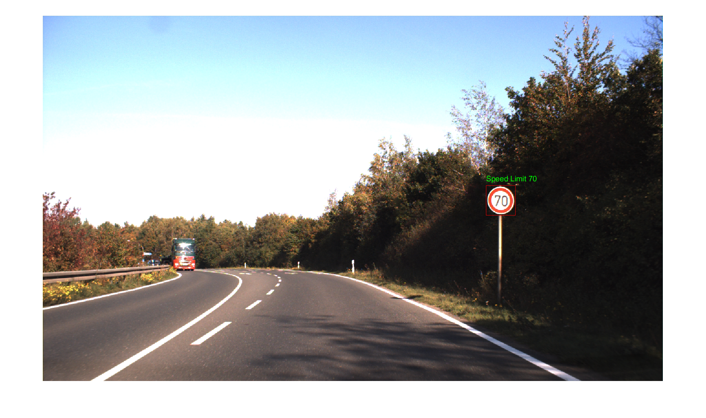
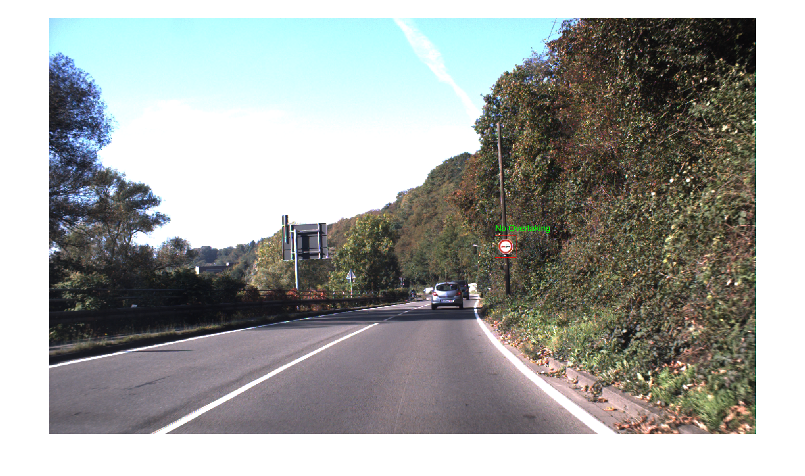

# Traffic Sign Detection and Recognition  

## Overview  
Traffic sign detection and recognition is a crucial task in intelligent transportation systems, enhancing road safety and optimizing traffic management. This project implements a Traffic Sign Detection and Recognition system using MATLAB, leveraging machine learning techniques and masks to improve accuracy and robustness. 
<p align="center">
  
  
</p>

## Features  
- **Preprocessing**: Image enhancement using Gaussian filters and histogram equalization.  
- **Traffic Sign Detection**: Using color segmentation in the HSV color space.  
- **Shape Classification**: Identifies traffic sign shapes (diamond, circular, hexagonal, rectangular).  
- **Symbol Recognition**: Matches detected signs with reference images using the Joint Transform Correlator (JTC).  
- **Machine Learning**: Implements Random Forest classifiers to enhance detection accuracy.  

## Methodology  
1. **Preprocessing**: Enhances image quality by reducing noise and addressing lighting variations.  
2. **Color Segmentation**: Converts RGB to HSV and isolates traffic signs based on hue and saturation values.  
3. **Shape Classification**: Differentiates traffic signs by calculating their extent ratio.  
4. **Symbol Recognition**: Uses area and perimeter ratios for precise classification.  
5. **Machine Learning Model**: Utilizes a Random Forest classifier trained on a dataset of 16,000 images to recognize traffic signs accurately.  

## Results  
- **Dataset**: 16,000 images (11,800 training, 4,800 testing).  
- **Evaluation Metrics**:  
  - ROC-AUC: 99%  
  - Precision-Recall Curve: 99%  
  - F1-Score: ~97%  
- **Model Performance**: Successfully detected various signs like speed limits, no overtaking, and stop signs.  
- **Challenges**: Some incorrect predictions on unseen data, suggesting potential overfitting.  

## Installation  
1. Install MATLAB with the required toolboxes.  
2. Clone the repository:  
   ```sh
   git clone https://github.com/yourusername/Traffic-Sign-Detection.git
   cd Traffic-Sign-Detection
3. Run the main script in MATLAB.

## Usage
1. Load the dataset into MATLAB.
2. Run the detection and recognition pipeline.
3. View results and model performance metrics.

## Contributors
- **Ahmed Mohamed Mohamed Eshennawy**
- **Anas Mohamed Amin**
- **Mohamed Mohamed Gouda**
- **Elsaeed Ahmed Nader**
- **Karim Ibrahim Fathy**

## Supervisor
- **Prof. Fatma Newagy**

## References
- **Sallah, Siti Sarah Md, et al.** Road sign detection and recognition system for real-time embedded applications.
- **Khan, Taha.** Real-Time Recognition System for Traffic Signs.
- **Liang, Ming, et al.** Traffic sign detection by ROI extraction and histogram features-based recognition.
- **Biau, G., Scornet, E.** A random forest guided tour.


